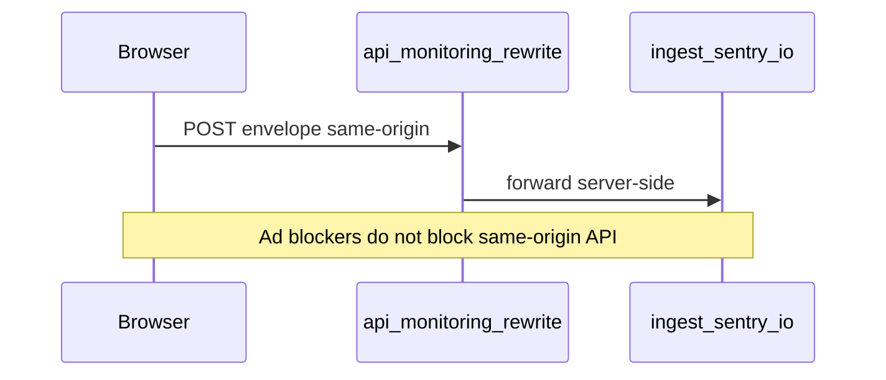

# Integration Guide: Redis, Sentry & PostHog

> **Purpose:** Portable reference for Next.js 15+ App Router projects  
> **Reusable:** Attach this file to any project and follow section-by-section  
> **Stack:** Node 18+, Next.js App Router, Upstash Redis, `@sentry/nextjs` v10+, optional PostHog  
> **Last updated:** 2026-08-20

---

## Table of Contents

1. [Redis (Upstash)](#1-redis-upstash)
2. [Sentry Error Tracking](#2-sentry-error-tracking)
3. [PostHog Analytics (optional)](#3-posthog-analytics-optional)
4. [Integration Checklist](#integration-checklist)
5. [Troubleshooting](#troubleshooting)

---

## 1. Redis (Upstash)

### Overview

Upstash Redis works in serverless and edge environments. Two common patterns:

| Pattern | Use case |
|---------|----------|
| **A — API response cache** | Cache expensive API/DB reads with TTL |
| **B — Session / state storage** | User sessions, chat history, keyed state with TTL |

Caching should **fail gracefully** — if Redis is down, the app still works.

### Prerequisites

- [Upstash](https://upstash.com) account (free tier available)
- Next.js project

### Step 1: Install

```bash
npm install @upstash/redis
```

### Step 2: Environment variables

```env
UPSTASH_REDIS_URL=https://your-instance.upstash.io
UPSTASH_REDIS_TOKEN=your-token
```

Get from: Upstash Console → your database → REST API.

---

### Pattern A — API response cache

Create `lib/redis.ts`:

```typescript
import { Redis } from "@upstash/redis";

export const redis = new Redis({
  url: process.env.UPSTASH_REDIS_URL || "",
  token: process.env.UPSTASH_REDIS_TOKEN || "",
});

export async function getCache<T>(key: string): Promise<T | null> {
  try {
    return await redis.get<T>(key);
  } catch (error) {
    console.error("Redis get error:", error);
    return null;
  }
}

export async function setCache<T>(
  key: string,
  value: T,
  ttlSeconds?: number
): Promise<void> {
  try {
    if (ttlSeconds) {
      await redis.setex(key, ttlSeconds, value);
    } else {
      await redis.set(key, value);
    }
  } catch (error) {
    console.error("Redis set error:", error);
  }
}

export async function deleteCache(key: string): Promise<void> {
  try {
    await redis.del(key);
  } catch (error) {
    console.error("Redis delete error:", error);
  }
}

/** Consistent key naming — adjust namespaces to your domain */
export const cacheKeys = {
  userProfile: (userId: string) => `user:profile:${userId}`,
  apiSearch: (queryHash: string) => `api:search:${queryHash}`,
  pageData: (slug: string) => `page:${slug}`,
};
```

Wrap API routes:

```typescript
import { NextResponse } from "next/server";
import { getCache, setCache, cacheKeys } from "@/lib/redis";

const TTL = 60 * 30; // 30 minutes

export async function GET() {
  const key = cacheKeys.apiSearch("my-query-hash");
  const cached = await getCache<unknown>(key);
  if (cached) return NextResponse.json(cached);

  const data = await fetchExpensiveData();
  await setCache(key, data, TTL);
  return NextResponse.json(data);
}
```

Invalidate on mutation:

```typescript
import { deleteCache, cacheKeys } from "@/lib/redis";

export async function POST() {
  await updateData();
  await deleteCache(cacheKeys.userProfile("user-123"));
  return NextResponse.json({ ok: true });
}
```

---

### Pattern B — Session / state storage

Extend `lib/redis.ts` for TTL-backed sessions:

```typescript
export interface SessionMessage {
  role: "user" | "assistant";
  content: string;
  timestamp: number;
}

export interface Session {
  id: string;
  messages: SessionMessage[];
  createdAt: number;
  updatedAt: number;
}

export async function getSession(sessionId: string): Promise<Session | null> {
  const data = await redis.get(`session:${sessionId}`);
  if (!data) return null;
  return typeof data === "string" ? JSON.parse(data) : (data as Session);
}

export async function saveSession(
  sessionId: string,
  messages: SessionMessage[],
  ttlSeconds = 60 * 60 * 24 * 30 // 30 days
): Promise<Session> {
  const session: Session = {
    id: sessionId,
    messages,
    createdAt: Date.now(),
    updatedAt: Date.now(),
  };
  await redis.setex(`session:${sessionId}`, ttlSeconds, JSON.stringify(session));
  return session;
}
```

**Optional — hash storage for metadata/vectors:**

```typescript
export async function storeHash(
  key: string,
  field: string,
  value: string
): Promise<void> {
  await redis.hset(key, { [field]: value });
}
```

---

## 2. Sentry Error Tracking

### Overview

Lean `@sentry/nextjs` setup for Next.js App Router:

- **Client, server, and edge** runtimes
- **Same-origin tunnel** at `/api/monitoring` — bypasses ad blockers (uBlock, Privacy Badger)
- **Noise filters** — ignore browser extensions, benign browser quirks, not real app bugs
- **No Session Replay / console integration** — keeps free-tier overhead low



### Prerequisites

- Sentry account (free tier)
- Next.js 15+ App Router
- Node 18+

### Step 1: Install

```bash
npm install @sentry/nextjs
```

### Step 2: Environment variables

```env
# Browser (required for client-side errors)
NEXT_PUBLIC_SENTRY_DSN=https://xxx@xxx.ingest.sentry.io/xxx

# Server alias (optional — falls back to NEXT_PUBLIC_SENTRY_DSN)
SENTRY_DSN=

# Build-time source map upload (Vercel CI — not exposed to browser)
SENTRY_ORG=your-org-slug
SENTRY_PROJECT=your-project-slug
SENTRY_AUTH_TOKEN=your-auth-token
```

| Variable | Where to get it |
|----------|-----------------|
| `NEXT_PUBLIC_SENTRY_DSN` | Sentry → Project Settings → Client Keys (DSN) |
| `SENTRY_ORG` | Sentry → Settings → General |
| `SENTRY_PROJECT` | Project **slug** (not org name) |
| `SENTRY_AUTH_TOKEN` | Sentry → Settings → Auth Tokens (`project:releases`) |

Sentry is **disabled when DSN is empty** — safe for local dev without keys.

---

### Step 3: Shared helpers

#### `lib/sentry-env.ts`

```typescript
export function getClientSentryDsn(): string | undefined {
  const dsn = process.env.NEXT_PUBLIC_SENTRY_DSN?.trim();
  return dsn || undefined;
}

export function getServerSentryDsn(): string | undefined {
  const dsn =
    process.env.SENTRY_DSN?.trim() || process.env.NEXT_PUBLIC_SENTRY_DSN?.trim();
  return dsn || undefined;
}

export function getTracesSampleRate(): number {
  return process.env.NODE_ENV === "production" ? 0.1 : 1.0;
}

/** Same-origin tunnel — bypasses ad blockers blocking ingest.sentry.io */
export const SENTRY_TUNNEL_ROUTE = "/api/monitoring";
```

#### `lib/sentry-filters.ts`

Single source of truth for noise filtering:

```typescript
import type { ErrorEvent } from "@sentry/core";

export const SENTRY_IGNORE_ERRORS: Array<string | RegExp> = [
  "ResizeObserver loop limit exceeded",
  "Non-Error promise rejection captured",
  "Script error.",
  /Loading chunk [\d]+ failed/,
  "top.GLOBALS",
  "AbortError",
  // ... extend as needed
];

const THIRD_PARTY_PATTERNS = [
  /chrome-extension:\/\//i,
  /moz-extension:\/\//i,
  /grammarly/i,
  /googletranslate/i,
];

function isThirdPartyNoise(text: string): boolean {
  return THIRD_PARTY_PATTERNS.some((p) => p.test(text));
}

export function sentryBeforeSend(event: ErrorEvent): ErrorEvent | null {
  const text = JSON.stringify(event.exception ?? event.message ?? "");
  if (isThirdPartyNoise(text)) return null;
  return event;
}
```

**Also configure** Sentry Dashboard → Project Settings → Inbound Filters (ignore errors from browser extensions) as a secondary layer.

---

### Step 4: Runtime config files

#### `sentry.server.config.ts` (Node.js — seed route, RSC)

```typescript
import * as Sentry from "@sentry/nextjs";
import { getServerSentryDsn, getTracesSampleRate } from "./lib/sentry-env";
import { SENTRY_IGNORE_ERRORS, sentryBeforeSend } from "./lib/sentry-filters";

Sentry.init({
  dsn: getServerSentryDsn(),
  enabled: !!getServerSentryDsn(),
  tracesSampleRate: getTracesSampleRate(),
  environment: process.env.NODE_ENV || "development",
  debug: false,
  ignoreErrors: SENTRY_IGNORE_ERRORS,
  beforeSend: sentryBeforeSend,
});
```

#### `sentry.edge.config.ts` (Edge — middleware, edge API routes)

Same as server config — use `getServerSentryDsn()` and shared filters.

---

### Step 5: Instrumentation (required — do NOT use `sentry.client.config.ts`)

#### `instrumentation.ts` (project root)

```typescript
export async function register() {
  if (process.env.NEXT_RUNTIME === "nodejs") {
    await import("./sentry.server.config");
  }
  if (process.env.NEXT_RUNTIME === "edge") {
    await import("./sentry.edge.config");
  }
}

export const onRequestError = async (
  error: unknown,
  request: { path: string; method: string; headers: Record<string, string | string[] | undefined> },
  context: { routerKind: string; routePath: string; routeType: string }
) => {
  const Sentry = await import("@sentry/nextjs");
  Sentry.captureException(error, { extra: { request, context } });
};
```

#### `instrumentation-client.ts` (project root)

Client init via Next.js client instrumentation — **no `layout.tsx` client conversion**:

```typescript
import * as Sentry from "@sentry/nextjs";
import {
  getClientSentryDsn,
  getTracesSampleRate,
  SENTRY_TUNNEL_ROUTE,
} from "./lib/sentry-env";
import { SENTRY_IGNORE_ERRORS, sentryBeforeSend } from "./lib/sentry-filters";

Sentry.init({
  dsn: getClientSentryDsn(),
  enabled: !!getClientSentryDsn(),
  tunnel: SENTRY_TUNNEL_ROUTE,
  tracesSampleRate: getTracesSampleRate(),
  environment: process.env.NODE_ENV || "development",
  debug: false,
  ignoreErrors: SENTRY_IGNORE_ERRORS,
  beforeSend: sentryBeforeSend,
});

export const onRouterTransitionStart = Sentry.captureRouterTransitionStart;
```

---

### Step 6: Tunnel — ad-blocker bypass

Wrap `next.config.ts`:

```typescript
import type { NextConfig } from "next";
import { withSentryConfig } from "@sentry/nextjs";

const nextConfig: NextConfig = {
  // your config
};

export default withSentryConfig(nextConfig, {
  org: process.env.SENTRY_ORG,
  project: process.env.SENTRY_PROJECT,
  authToken: process.env.SENTRY_AUTH_TOKEN,
  tunnelRoute: "/api/monitoring",
  silent: true,
  telemetry: false,
  widenClientFileUpload: true,
  sourcemaps: {
    deleteSourcemapsAfterUpload: true,
  },
  bundleSizeOptimizations: {
    excludeDebugStatements: true,
  },
});
```

**How it works:**

1. Client SDK POSTs to same-origin `/api/monitoring` (not `*.ingest.sentry.io`)
2. `@sentry/nextjs` registers a **Next.js rewrite** at build time
3. Server forwards the envelope to Sentry ingest

**Verify after build:**

```bash
npm run build
# Check .next/routes-manifest.json → rewrites.afterFiles contains /api/monitoring
```

Works in normal browser + incognito when ad blockers are enabled.  
`robots.txt` disallowing `/api/` affects **crawlers only**, not browser SDK POSTs.

---

### Step 6b: Quiet Vercel / CI builds (recommended)

Sentry source map upload and Next.js telemetry can flood deploy logs without adding runtime value. Keep uploads enabled; reduce **log noise only**.

#### `next.config.ts` — Sentry webpack plugin

| Option | Value | Why |
|--------|-------|-----|
| `silent` | `true` | Suppresses per-file source map upload reports in Vercel/CI logs |
| `telemetry` | `false` | Disables Sentry webpack-plugin telemetry banner during build |
| `sourcemaps.deleteSourcemapsAfterUpload` | `true` | **Security:** maps upload to Sentry, then are removed from the deploy artifact |
| `tunnelRoute` | `"/api/monitoring"` | Unchanged — runtime tunnel still works |
| `authToken` + org/project | Set on Vercel | Source maps **still upload** when token is present; logs are just quieter |

```typescript
export default withSentryConfig(nextConfig, {
  org: process.env.SENTRY_ORG,
  project: process.env.SENTRY_PROJECT,
  authToken: process.env.SENTRY_AUTH_TOKEN,
  tunnelRoute: "/api/monitoring",
  silent: true,
  telemetry: false,
  widenClientFileUpload: true,
  sourcemaps: {
    deleteSourcemapsAfterUpload: true,
  },
  bundleSizeOptimizations: {
    excludeDebugStatements: true,
  },
});
```

**Do not** set `silent: !process.env.CI` if you want quiet Vercel builds — on Vercel `CI=1`, that makes logs **more** verbose.

#### `package.json` — Next.js telemetry + npm install noise

```json
{
  "scripts": {
    "build": "NEXT_TELEMETRY_DISABLED=1 next build",
    "postinstall": "update-browserslist-db --quiet"
  },
  "allowScripts": {
    "@sentry/cli": true,
    "sharp": true,
    "unrs-resolver": true,
    "fsevents": true
  },
  "devDependencies": {
    "update-browserslist-db": "^1.2.3"
  }
}
```

| Setting | Purpose |
|---------|---------|
| `NEXT_TELEMETRY_DISABLED=1` | Removes Next.js anonymous telemetry banner from build output |
| `postinstall` + `update-browserslist-db` | Refreshes `caniuse-lite`; avoids “browsers data is N months old” warning |
| `allowScripts` (npm 11+) | Whitelists trusted postinstall scripts (`@sentry/cli`, `sharp`, etc.) — reduces `npm warn allow-scripts` noise |

#### `.npmrc` (optional)

```
fund=false
```

Suppresses `npm fund` messages in CI. Does not affect installs or security.

#### Expected warnings you can ignore (this repo)

| Log line | Meaning |
|----------|---------|
| `Custom Cache-Control headers detected for /_next/static/(.*)` | Intentional immutable caching (see `docs/VERCEL_PRODUCTION_GUARDRAILS.md`) — safe in production |
| `The Edge Runtime is deprecated` | Informational on Next.js 16.3+ when API routes use `export const runtime = "edge"` |
| `Using edge runtime on a page currently disables static generation` | Expected for Edge API routes (`/api/chat`, `/api/history`, etc.) |

These are **not** Sentry or observability failures.

---

### Step 7: Global error boundary

Create `app/global-error.tsx`:

```typescript
"use client";

import * as Sentry from "@sentry/nextjs";
import { useEffect } from "react";

export default function GlobalError({
  error,
  reset,
}: {
  error: Error & { digest?: string };
  reset: () => void;
}) {
  useEffect(() => {
    Sentry.captureException(error);
  }, [error]);

  return (
    <html lang="en">
      <body>
        <h2>Something went wrong</h2>
        <button type="button" onClick={() => reset()}>Try again</button>
      </body>
    </html>
  );
}
```

---

### Step 8: Manual capture in API routes (optional)

```typescript
import * as Sentry from "@sentry/nextjs";

export async function GET() {
  try {
    return Response.json(await fetchData());
  } catch (error) {
    Sentry.captureException(error, { tags: { api_route: "/api/example" } });
    return Response.json({ error: "Internal server error" }, { status: 500 });
  }
}
```

---

### What we intentionally skip (noise, not app bugs)

| Filter | Examples |
|--------|----------|
| `ignoreErrors` | ResizeObserver, Script error., chunk load failures, AbortError |
| `beforeSend` | `chrome-extension://`, Grammarly, Google Translate, MetaMask stacks |
| Not included | Session Replay, console logging integration, profiling |

Real app errors in your code **still report**. Extension-injected errors **do not**.

---

### Deprecated patterns — do NOT use

| Old | Use instead |
|-----|-------------|
| `sentry.client.config.ts` | `instrumentation-client.ts` |
| Sentry init in `layout.tsx` useEffect | Client instrumentation hook |
| `hideSourceMaps: true` | `sourcemaps: { deleteSourcemapsAfterUpload: true }` |
| `disableLogger: true` | `bundleSizeOptimizations: { excludeDebugStatements: true }` |
| Direct ingest URL (no tunnel) | `tunnelRoute` + client `tunnel` option |

---

## 3. PostHog Analytics (optional)

> **Optional — copy when needed.** Not required in every project. The FAQ chatbot reference repo does **not** ship PostHog wired by default.

### Overview

Product analytics, feature flags, session replay. Client-side tracking via `posthog-js`.

### Prerequisites

- PostHog account (free tier)
- Next.js project

### Step 1: Install

```bash
npm install posthog-js
```

### Step 2: Environment variables

```env
NEXT_PUBLIC_POSTHOG_KEY=phc_xxx
NEXT_PUBLIC_POSTHOG_HOST=https://eu.i.posthog.com
```

Use `https://app.posthog.com` for US region.

### Step 3: Client library

Create `lib/posthog.ts`:

```typescript
import posthog from "posthog-js";

export function initPostHog(): void {
  if (typeof window === "undefined") return;

  const key = process.env.NEXT_PUBLIC_POSTHOG_KEY;
  const host = process.env.NEXT_PUBLIC_POSTHOG_HOST;
  if (!key || !host) return;

  posthog.init(key, {
    api_host: host,
    capture_pageview: false, // manual pageviews in App Router
    loaded: (ph) => {
      if (process.env.NODE_ENV === "development") ph.debug();
    },
  });
}

export function trackEvent(name: string, properties?: Record<string, unknown>) {
  if (typeof window !== "undefined" && posthog.__loaded) {
    posthog.capture(name, properties);
  }
}
```

### Step 4: Provider (client component)

Create `components/providers/posthog-provider.tsx`:

```typescript
"use client";

import { useEffect } from "react";
import { usePathname, useSearchParams } from "next/navigation";
import posthog from "posthog-js";
import { initPostHog } from "@/lib/posthog";

export function PostHogProvider({ children }: { children: React.ReactNode }) {
  const pathname = usePathname();
  const searchParams = useSearchParams();

  useEffect(() => {
    initPostHog();
  }, []);

  useEffect(() => {
    if (pathname && posthog.__loaded) {
      posthog.capture("$pageview", { $current_url: window.location.href });
    }
  }, [pathname, searchParams]);

  return <>{children}</>;
}
```

Add to `app/providers.tsx` (inside existing client providers):

```typescript
import { PostHogProvider } from "@/components/providers/posthog-provider";

export function Providers({ children }: { children: React.ReactNode }) {
  return (
    <PostHogProvider>
      {/* other providers */}
      {children}
    </PostHogProvider>
  );
}
```

### Ad-blocker note

PostHog ingest domains can be blocked like Sentry. For production, consider a [reverse proxy / first-party host](https://posthog.com/docs/advanced/proxy) so events use your domain.

---

## Integration Checklist

### Redis

- [ ] Install `@upstash/redis`
- [ ] Set `UPSTASH_REDIS_URL` and `UPSTASH_REDIS_TOKEN`
- [ ] Create `lib/redis.ts` (Pattern A and/or B)
- [ ] Graceful error handling (cache miss on failure)
- [ ] Invalidate cache keys on mutations

### Sentry

- [ ] Install `@sentry/nextjs`
- [ ] Set env vars (`NEXT_PUBLIC_SENTRY_DSN` minimum)
- [ ] Create `lib/sentry-env.ts` and `lib/sentry-filters.ts`
- [ ] Create `sentry.server.config.ts` and `sentry.edge.config.ts`
- [ ] Create `instrumentation.ts` with `register` + `onRequestError`
- [ ] Create `instrumentation-client.ts` with tunnel + `onRouterTransitionStart`
- [ ] Wrap `next.config.ts` with `withSentryConfig` + `tunnelRoute: "/api/monitoring"`
- [ ] Set `silent: true` and `telemetry: false` for quiet CI/Vercel builds (Step 6b)
- [ ] Set `NEXT_TELEMETRY_DISABLED=1` on build script; optional `.npmrc` + `allowScripts`
- [ ] Create `app/global-error.tsx`
- [ ] Verify tunnel rewrite in `.next/routes-manifest.json` after build
- [ ] Set Vercel env vars for production + source maps
- [ ] Test: real error appears in dashboard; extension noise does not

### PostHog (optional)

- [ ] Install `posthog-js`
- [ ] Set `NEXT_PUBLIC_POSTHOG_KEY` and `NEXT_PUBLIC_POSTHOG_HOST`
- [ ] Create `lib/posthog.ts` and provider
- [ ] Verify events in PostHog dashboard
- [ ] Consider reverse proxy for ad-blocker resilience

---

## Troubleshooting

### Sentry

| Issue | Fix |
|-------|-----|
| Events blocked in browser with ad blocker | Ensure `tunnelRoute` in `next.config.ts` **and** `tunnel` in client init match (`/api/monitoring`) |
| Tunnel 404 | Rebuild; check `routes-manifest.json` rewrites |
| No client events | Set `NEXT_PUBLIC_SENTRY_DSN` on Vercel (must be present at **build** time for client bundle) |
| No source maps | Set `SENTRY_AUTH_TOKEN`, `SENTRY_ORG`, `SENTRY_PROJECT` in CI/Vercel |
| Verbose Sentry upload log on Vercel | Set `silent: true` and `telemetry: false` in `withSentryConfig` (Step 6b) — uploads still run when token is set |
| Next.js telemetry banner in build | Add `NEXT_TELEMETRY_DISABLED=1` to `build` script |
| `Browserslist: browsers data is N months old` | Add `update-browserslist-db` postinstall (Step 6b) |
| Too much noise (extensions) | Expand `lib/sentry-filters.ts`; enable Sentry Inbound Filters |
| Sentry disabled locally | Expected when DSN empty — set DSN to test |

### Redis

| Issue | Fix |
|-------|-----|
| Connection errors | Verify URL/token; check Upstash dashboard |
| Stale cache | Reduce TTL or invalidate on write |

### PostHog

| Issue | Fix |
|-------|-----|
| Events not tracking | Check API key and host region |
| Blocked by ad blocker | Use reverse proxy / first-party host |

---

## References

- [Sentry Next.js Docs](https://docs.sentry.io/platforms/javascript/guides/nextjs/)
- [Upstash Redis Docs](https://upstash.com/docs/redis)
- [PostHog Next.js Docs](https://posthog.com/docs/libraries/next-js)
